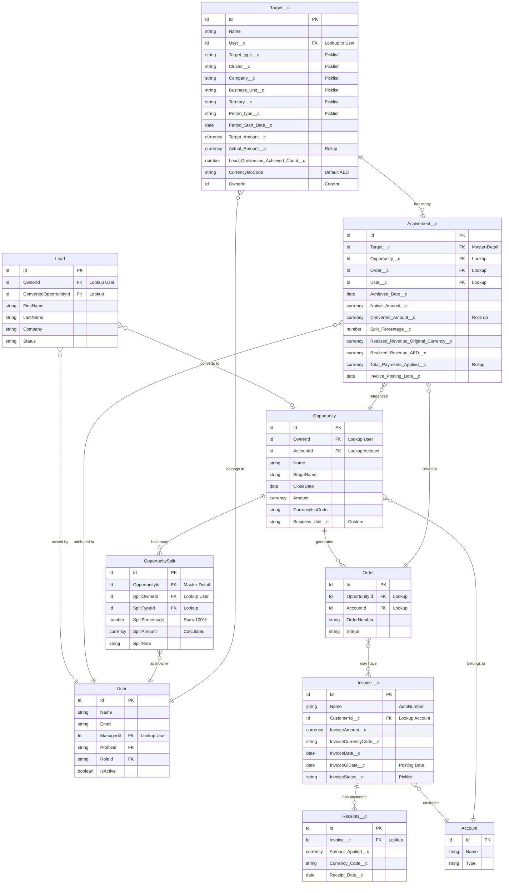

# Targets and Achievements - Visual ER Diagram

Copy and paste this Mermaid diagram into any Mermaid-compatible viewer (e.g., GitHub, Mermaid Live Editor, VS Code with Mermaid extension).

## Quick Reference: Key Relationships

1. **Target → Achievement**: Master-Detail (1:Many)
   - Achievements roll up `Converted_Amount__c` to `Target.Actual_Amount__c`

2. **Opportunity → OpportunitySplit**: Master-Detail (1:Many)
   - Split percentages must sum to 100%
   - Split owners filtered by Custom Label roles

3. **Opportunity → Order → Invoice → Receipts → Achievement**
   - Realized revenue flow
   - Multiple payments roll up to single Achievement

4. **Lead → Opportunity → Achievement**
   - Lead conversion KPI tracking
   - Attributes to Lead Owner's Target

## Custom Label Usage

- **Achievement_Attribution_Roles**: "Sales Coordinator,Account Manager"
  - Used to determine eligible users for achievement attribution
  - Applied to Opportunity Split and Opportunity Team Member filtering

