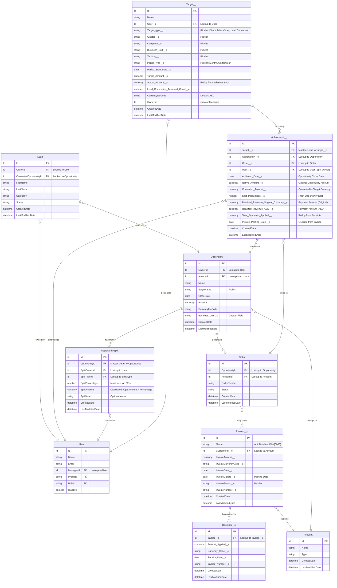

# Targets and Achievements - ER Diagram

This document provides a comprehensive Entity-Relationship (ER) diagram for the Targets and Achievements module based on the user stories, acceptance criteria, and solutions.

## ER Diagram (Mermaid Format)



## Key Relationships Summary

### 1. Target → Achievement (Master-Detail)
- **Cardinality**: One-to-Many
- **Relationship**: `Achivement__c.Target__c` → `Target__c.Id`
- **Behavior**: 
  - Achievements roll up to Target via `Actual_Amount__c` field
  - Deletion of Target cascades to Achievements

### 2. Opportunity Split → Opportunity (Master-Detail)
- **Cardinality**: One-to-Many
- **Relationship**: `OpportunitySplit.OpportunityId` → `Opportunity.Id`
- **Behavior**:
  - Split percentages must sum to 100% (validation rule)
  - Splits are locked when Opportunity is Closed Won
  - Split owners are determined by Custom Label: `Achievement_Attribution_Roles` = "Sales Coordinator,Account Manager"

### 3. Achievement Attribution Logic
1. **Primary**: Opportunity Split records with eligible roles (from Custom Label)
2. **Secondary**: First Opportunity Team Member with eligible role (100% attribution)
3. **Fallback**: Opportunity Owner (100% attribution)

### 4. Realized Revenue Flow
```
Opportunity → Order → Invoice → Receipts → Achievement
```
- When Order is created, link to Achievement via `Order__c`
- When Payment (Receipts__c) is applied to Invoice, roll up to Achievement
- Multiple payments roll up to single Achievement record
- Currency conversion handled via `TargetCurrencyService`

### 5. Lead Conversion KPI
- Lead `OwnerId` → Target `User__c` match
- Increments `Lead_Conversion_Achieved_Count__c` on Target
- Separate from revenue achievements

## Field Details

### Target Object Key Fields
| Field API Name | Type | Required | Description |
|---------------|------|----------|-------------|
| `User__c` | Lookup(User) | Yes | Target assigned user |
| `Target_type__c` | Picklist | Yes | Direct Sales Order, Lead Conversion |
| `Cluster__c` | Picklist | Yes | Energy Cluster |
| `Company__c` | Picklist | Yes | Company within cluster |
| `Business_Unit__c` | Picklist | Yes | Business Unit |
| `Territory__c` | Picklist | No | Territory |
| `Period_type__c` | Picklist | Yes | Month/Quarter/Year |
| `Period_Start_Date__c` | Date | Yes | Period start date |
| `Target_Amount__c` | Currency | Yes | Target amount |
| `Actual_Amount__c` | Currency | Auto | Rollup sum of `Achivement__c.Converted_Amount__c` |
| `Lead_Conversion_Achieved_Count__c` | Number | No | Count of converted leads |
| `CurrencyIsoCode` | Currency | Yes | Default: AED |

### Achievement Object Key Fields
| Field API Name | Type | Required | Description |
|---------------|------|----------|-------------|
| `Target__c` | MasterDetail(Target) | Yes | Parent Target |
| `Opportunity__c` | Lookup(Opportunity) | Yes | Related Opportunity |
| `Order__c` | Lookup(Order) | No | Related Order (for realized revenue) |
| `User__c` | Lookup(User) | Yes | User attributed achievement |
| `Achieved_Date__c` | Date | Yes | Opportunity Close Date |
| `Native_Amount__c` | Currency | Yes | Original Opportunity Amount |
| `Converted_Amount__c` | Currency | Yes | Converted to Target Currency (rolls up to Target) |
| `Split_Percentage__c` | Number | No | Percentage from Opportunity Split |
| `Realized_Revenue_Original_Currency__c` | Currency | No | Total payments in original currency |
| `Realized_Revenue_AED__c` | Currency | No | Total payments in AED |
| `Total_Payments_Applied__c` | Currency | No | Rollup from Receipts (in Target currency) |
| `Invoice_Posting_Date__c` | Date | No | GL Date from Invoice |

### Opportunity Split Object Key Fields
| Field API Name | Type | Required | Description |
|---------------|------|----------|-------------|
| `OpportunityId` | MasterDetail(Opportunity) | Yes | Parent Opportunity |
| `SplitOwnerId` | Lookup(User) | Yes | User receiving split |
| `SplitPercentage` | Number | Yes | Must sum to 100% across all splits |
| `SplitAmount` | Currency | Yes | Calculated: Opportunity Amount × SplitPercentage |
| `SplitNote` | Text(255) | No | Optional notes |
| `SplitTypeId` | Lookup | No | Split type |

## Business Rules

### 1. Target Creation Rules
- Only Sales Directors and GMs can create Targets (via Permission Set)
- Periods must be non-overlapping for same User/BU/Year
- Target start date cannot be in the past (validation rule)
- Target Amount is editable only before period start
- Currency defaults to AED if not specified

### 2. Achievement Creation Rules
- Created automatically when Opportunity is Closed Won
- Target matching logic:
  - User__c matches Opportunity Split Owner or Team Member
  - Business_Unit__c matches Opportunity.Business_Unit__c
  - CloseDate falls within Target Period
- Achievement records are read-only for all users except System Admins

### 3. Opportunity Split Rules
- Total split percentage must equal 100% (hard validation)
- Splits are editable until Opportunity is Closed Won
- After Closed Won, splits are locked
- Split owners must have eligible roles (from Custom Label)

### 4. Realized Revenue Rules
- Multiple payments roll up to single Achievement record
- Currency conversion handled via `TargetCurrencyService`
- If invoice is cancelled/reversed, recalculate realized revenue
- Realized revenue never overwrites forecasted achievement

### 5. Lead Conversion Rules
- Only counts for Sales Coordinators (configurable via Target Type)
- Increments `Lead_Conversion_Achieved_Count__c` on Target
- Count-based rollup, independent of revenue targets

## Access Control & Sharing

### Target Sharing
- Users see only their own Targets (via Apex Sharing)
- Managers see roll-up views (User → Territory → BU → Company → Cluster)
- Access controlled via Permission Sets

### Achievement Sharing
- Read-only access for all users except System Admins
- Users see their own achievements
- Managers see team achievements via role hierarchy
- Follows role hierarchy: User → Proposal/Bid Manager → Sales Director → GM

## Integration Points

### 1. ERP Invoice Sync
- Invoices synced from ERP → Salesforce
- `RealizedRevenueService.linkOrderToAchievements()` links Orders to Achievements
- `RealizedRevenueService.updateAchievementsFromPayments()` updates realized revenue

### 2. Currency Conversion
- `TargetCurrencyService` handles all currency conversions
- Uses Costing Sheet JSON rates (if available) or Dated Conversion Rates
- Corporate currency (AED) used as intermediate conversion point

### 3. Opportunity Team Members
- Uses standard Opportunity Team Member object
- Roles checked against Custom Label: `Achievement_Attribution_Roles`

## Custom Labels

| Label API Name | Value | Purpose |
|---------------|-------|---------|
| `Achievement_Attribution_Roles` | "Sales Coordinator,Account Manager" | Configurable list of roles eligible for achievement attribution |

## Notes

- **Opportunity Share**: Standard Salesforce sharing mechanism used for Opportunity visibility
- **Opportunity Split**: Custom object with Master-Detail relationship to Opportunity
- **Split Attribution**: Based on Custom Label roles, not hardcoded
- **Realized Revenue**: Separate from Forecasted Achievement, both stored in Achievement object
- **Period Calculation**: Period end date calculated from `Period_Start_Date__c` and `Period_type__c`
- **Rollup Fields**: `Actual_Amount__c` on Target is auto-calculated via Apex trigger

---

**Document Version**: 1.0  
**Last Updated**: Based on Sprint 5 User Stories  
**Developer**: Abhijeet, Preethi, Ayush, Surdhika

